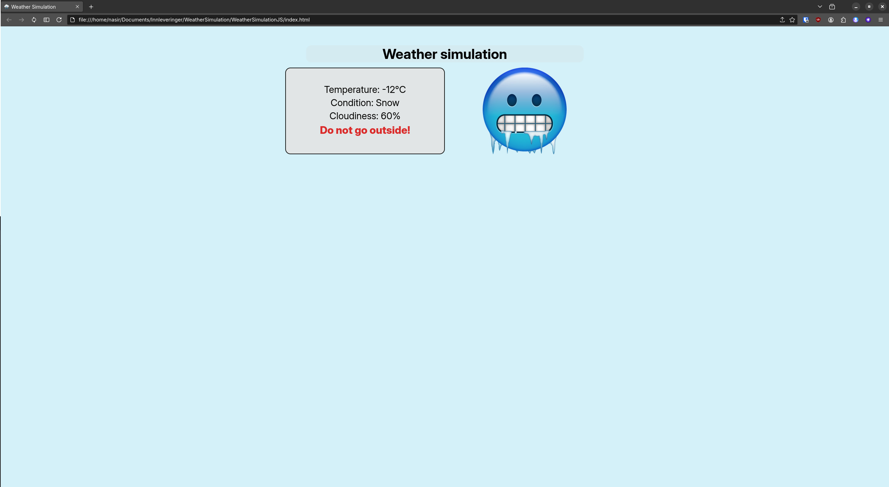
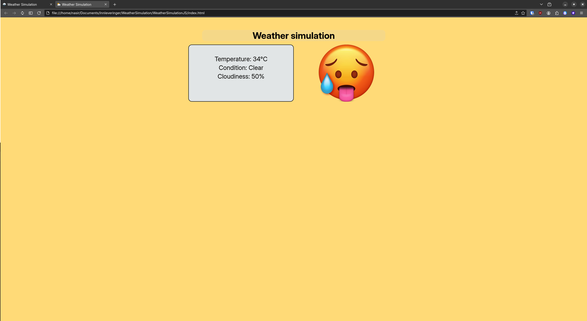
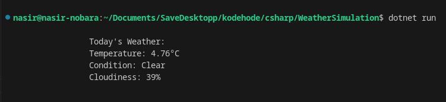

# Weather Simulation Project

## Part 1: Dynamic Weather Simulation in HTML/CSS and Javascript ('WeatherSimulationJS')
This part creates a dynamic weather simulation that updates the weather conditions every 3 minutes. It displays the weather information on a webpage, updates the favicon based on weather conditions and shows a silly image related to the weather. The webpage also provides warnings for extreme weather events, such as snow combined with low temperatures.

### Preview

 
 

## Part 2: Weather Simulation in C# ('WeatherSimulation')
This part generates random weather conditions every time the program runs. It displays weather details in the console and shows a warning if the weather is extremely cold (less than 10 degree celsius *and* snowy).

### Preview
 

## How to run:

### Part 1:
1. Clone the repository
2. Open the HTML file in your browser
3. The weather simulation will run automatically every 3 minutes.

### Part 2:
1. Open the C# file in your preferred IDE
2. Compile and run the program to see the generated weather details.

*Readme written with ChatGPT assistance*
